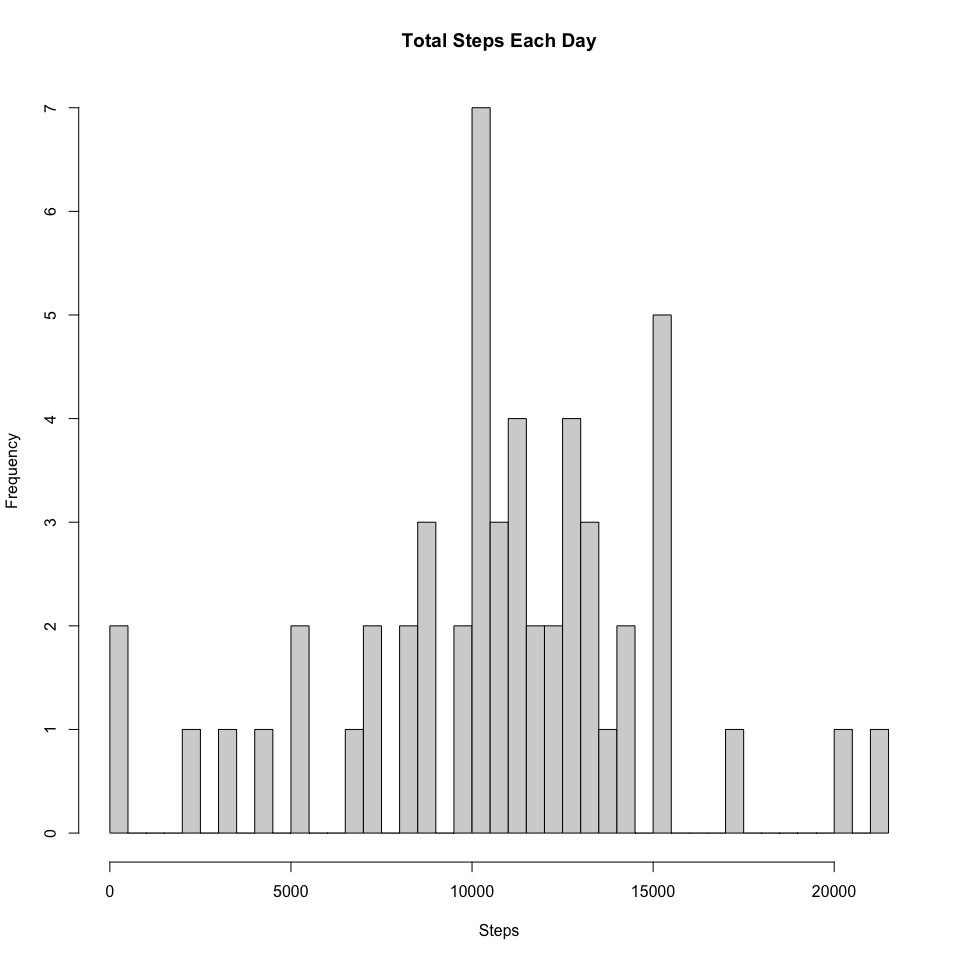
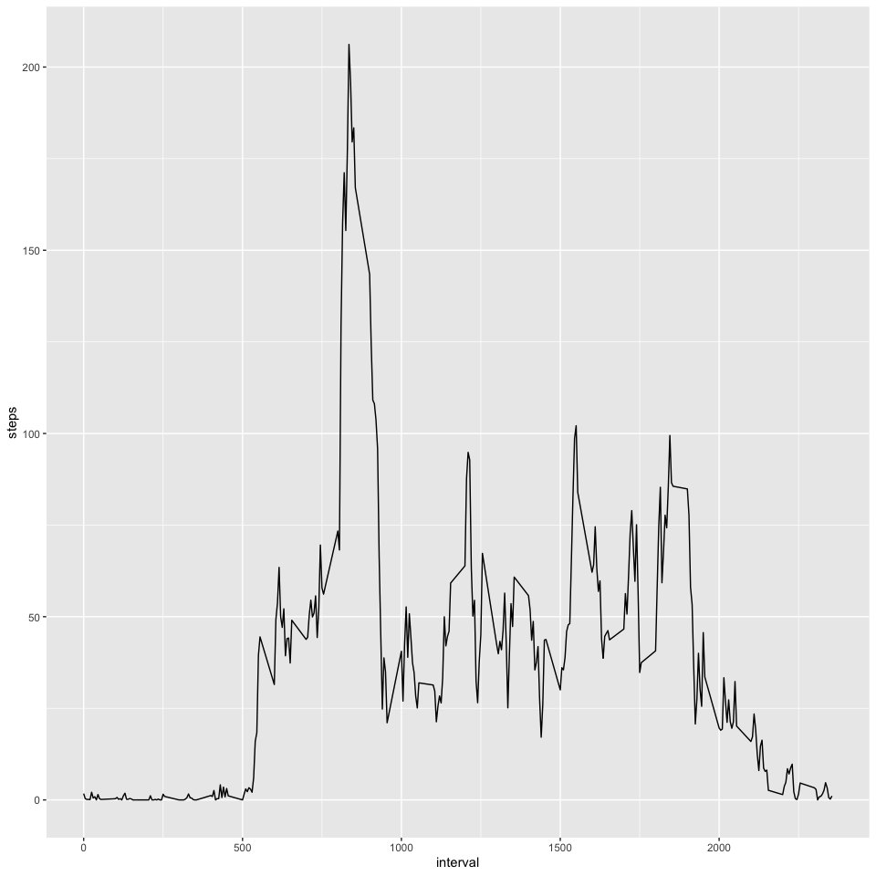
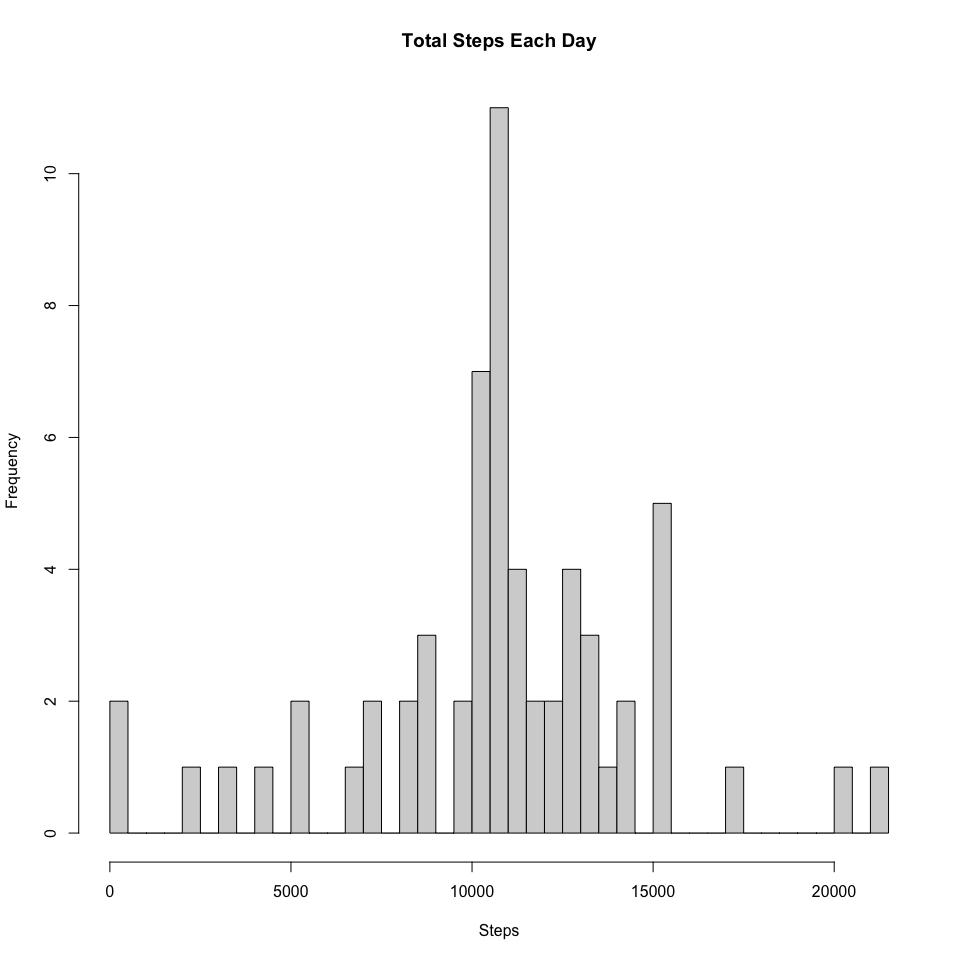
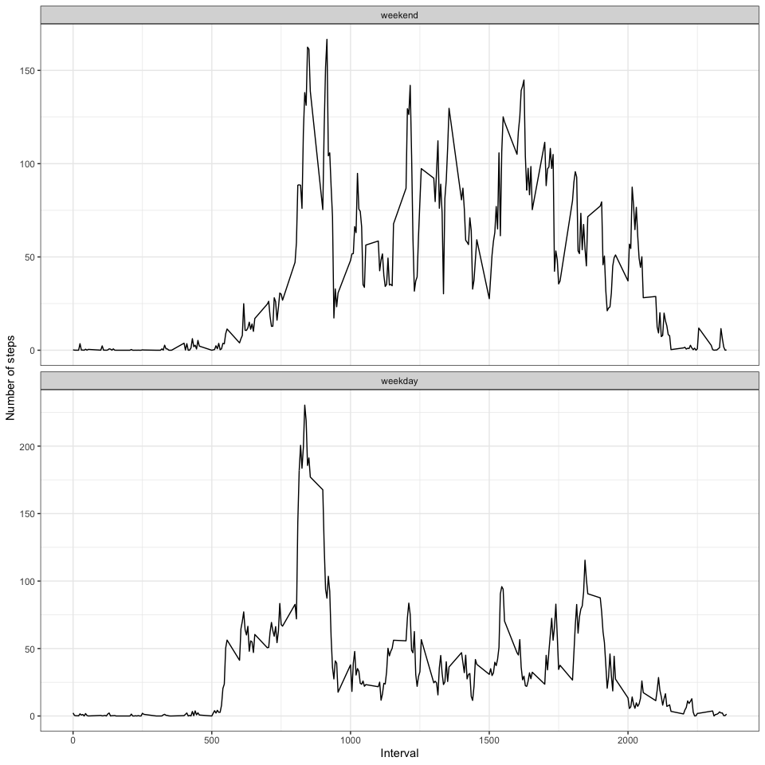

## Loading and preprocessing the data


```r
library(dplyr)
library(ggplot2)
activity <- read.csv('activity.csv')
activity$date <- as.Date(activity$date)
```


## What is mean total number of steps taken per day?


```r
activity2 <- aggregate(steps ~ date, data = activity, FUN = 'sum')
hist(activity2$steps,breaks = 53, xlab = 'Steps', main = 'Total Steps Each Day')
```

<!-- -->

```r
mean(activity2$steps)
```

```
## [1] 10766.19
```

```r
median(activity2$steps)
```

```
## [1] 10765
```

### Mean and median total number of steps taken per day are 10766.19 and 10765 respectively


## What is the average daily activity pattern?


```r
#Plot of the 5-minute interval and the average number of steps taken
activity3 <- activity %>% group_by(interval) %>% summarize(steps=mean(steps, na.rm=TRUE))
ggplot(data = activity3, aes(x=interval, y=steps)) + geom_line()
```

<!-- -->

```r
head(arrange(activity3, desc(steps)))
```

```
## # A tibble: 6 x 2
##   interval steps
##      <int> <dbl>
## 1      835  206.
## 2      840  196.
## 3      850  183.
## 4      845  180.
## 5      830  177.
## 6      820  171.
```

### Interval 835 on average across all the days in the dataset, contains the maximum number of steps

## Imputing missing values


```r
#Calculate and report the total number of missing values in the dataset
length(which(is.na(activity$steps)))
```

```
## [1] 2304
```

### There are 2304 rows with missing values for steps

### Impute to replace NA with mean of steps of that interval


```r
missing <- filter(activity, is.na(activity$steps))
not_miss <- filter(activity, !is.na(activity$steps))
for(i in 1:nrow(activity3)){
  for(j in 1:nrow(missing))
    if(activity3$interval[i]==missing$interval[j]){
    missing$steps <- activity3$steps
  }
}
#combine and arrange the datasets
activity4 <- rbind(missing, not_miss)
activity5 <- arrange(activity4, date, interval)
activity6 <- aggregate(steps ~ date, data = activity5, FUN = 'sum')
```
### Dataset was divided into missing and non missing and then using for loop missing values were replaced by mean of steps in that interval

### Histogram of the total number of steps taken each day after imputation

```r
hist(activity6$steps,breaks = 53, xlab = 'Steps', main = 'Total Steps Each Day')
```

<!-- -->

```r
mean(activity6$steps)
```

```
## [1] 10766.19
```

```r
median(activity6$steps)
```

```
## [1] 10766.19
```

### mean and median were 10766.19. No change in mean but a slight change by 1.19 was noticed in median


## Are there differences in activity patterns between weekdays and weekends?

### create new factor variable in the dataset with two levels -- "weekday" and "weekend" 

```r
activity5$tmp <- weekdays(activity5$date)
activity5$day <- ifelse(activity5$tmp=="Saturday", "weekend",
                 ifelse(activity5$tmp=="Sunday","weekend", "weekday"))
activity5$tmp <- NULL
activity5$day <- factor(activity5$day, levels = c("weekend", "weekday"))
activity7 <- activity5 %>% group_by(day, interval) %>% summarize(steps=mean(steps, na.rm=TRUE))
```

```
## `summarise()` has grouped output by 'day'. You can override using the `.groups` argument.
```

```r
head(activity7)
```

```
## # A tibble: 6 x 3
## # Groups:   day [1]
##   day     interval   steps
##   <fct>      <int>   <dbl>
## 1 weekend        0 0.215  
## 2 weekend        5 0.0425 
## 3 weekend       10 0.0165 
## 4 weekend       15 0.0189 
## 5 weekend       20 0.00943
## 6 weekend       25 3.51
```

### panel plot containing a time series plot (i.e. type = "l") of the 5-minute interval (x-axis) and the average number of steps taken, averaged across all weekday days or weekend days (y-axis)

```r
ggplot(data = activity7, aes(x=interval, y=steps)) + geom_line() + 
  facet_wrap(~day, ncol=1, scales = "free_y") + theme_bw() +
  labs(x='Interval', y='Number of steps')
```

<!-- -->

### Difference is activity pattern between weekdays and weekends were detected as shown in the plot above


